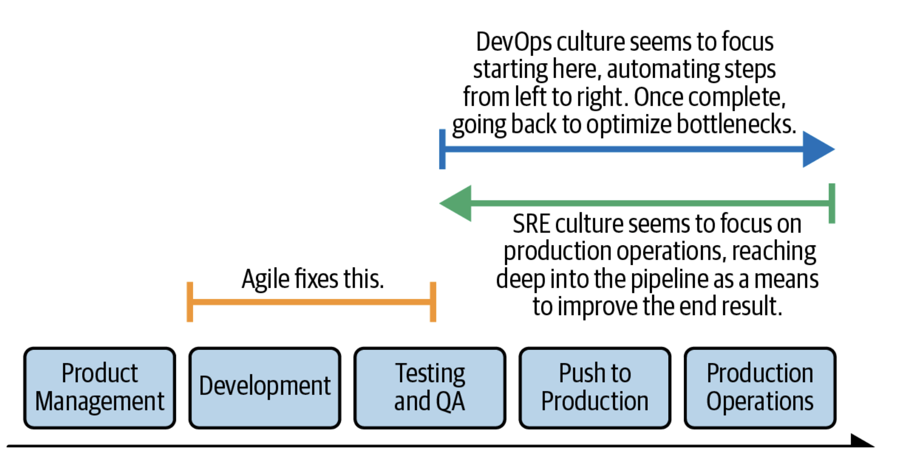

# Becoming SRE

> ⚠️ These are notes taken from the book [_Becoming SRE_ by David N. Blank-Edelman
> O'Reilly](https://learning.oreilly.com/library/view/becoming-sre/9781492090540/).
> It is an splendid book and no amount of notes I take will make it justice,
> **please go read it and just use this as a reference**.

# Table of Contents
<!-- toc -->

# Introduction to SRE

## First things first
> Site **Reliability** Engineering is an engineering discipline devoted to
> helpings orgs **sustainably** achieve the **appropriate** level of
> reliability in their systems, services and products.

3 key words from definition

- Reliability: even  if you have the best software in the world, and the best
  sales team, if the sw is not up when customers need it, you lose a lot of:
    - Revenue
    - Time
    - Reputation
    - Health
    - Hiring
- Appropriate
    - Usually 100% reliable is not achievable, it is likely that your
      dependencies are not 100% reliable.
    - You need to use ***service level indicators/service level objectives***
      (SLI/SLO) to help determine an appropriate level of reliability.
- Sustainable
    - If the people in the org are burned out they wont be able to build
      reliable systems.

### SRE vs Devops

1. SRE implements class devops
2. SRE is to reliability as devops is to delivery
3. It’s all about the direction

     _[Source: Becoming SRE
    O'Reilly](https://learning.oreilly.com/library/view/becoming-sre/9781492090540/)_

- Devops go from development to production operations
- SRE seems to start on prod operations, and going back to improve the result.

Basically these two phrases:

- Devops thinks, how can I deploy this from my laptop to production
- SRE starts at production, how can I make the environment more reliable.

## SRE Mindset

It is born out of curiosity: *How does a system work? How does it fail?*

Zoom out and Zoom in as much as possible, how does the… work

- The whole app, development and deployment process
- The entire service
- The infrastructure
- The physical overlay of the infra
- The sociotechnical  context in which the infra runs
- The org context where the sociotechnical context resides in

### Keeping Focus on the Customer

Small example, say you have a 100 servers running a front end pool, suddenly 14
systems fail and are not recovering.  This situation is:

1. No big deal; you can deal with it at your leisure
2. Something that warrants your immediate attentions. Stop what you are doing
and focus on this
3. Crisis, even if 2 AM go wake the CEO

The answer, *it depends*, you need to ask, how does this affect the system as a
whole. If the customers wont see anything diff then **a.** If visible by
customers then **b**. If the service is dead in the water and this means no
revenue, go wake the CEO.

So basically you need to ask: *What is the intention of the system from the
customer’s perspective?*

### SRE’s Relationship with Failure

SRE are very collaborative. Reliability is a collaborative endeavour by nature.

The SRE mindset views errors as an opportunity to learn. Learning from failure
is a core component of an SRE.

SRE treats errors as a signal and we like clear signals. With an SRE mindset
errors can serve the helping understand the system better. This means we need
to surface the errors in addition to eliminate them.

SRE feels ownership of the whole service, t**hey do not say often “not my code,
not my problem”.** This can be un *arma de doble filo.* Because of the **yak
shaving issue,** where you go to do one task, say update a package, but then
you check and for the new package you need to upgrade the OS, but to upgrade
the OS you need to… and you end up with a trimmer in your hands and a yak
infront of you. Taking ownership of the whole range of services and so on, can
lead to this. **

### The Mindset in Motion

- How does a system work? → How will the system work if we scale it?
- How does a system work? → How can the system work with less operational load
    - SREs are angered by **toil** and the almost allergic reaction it provokes
      in them.
- How does a system work? → How can the system work reliable for more people

## Culture

Support an enviorment where SREs can thrive.

- Celebrate the elimination of toil, give SREs opportunity to look for toil and
  come up with ideas on how to remove it.
- Support curosity

Other good way is to support the creation of documentation “it is not finished
until it is documented”

### New hires

For new hires good some good tasks are:

- Find something unclear, missing or in some way needing improvment on the docs
  and fix it.
    - This has the benefit that they need to interact with the docs and read
      it, at a deep enough level that they can improve it.
- Taking our inline database of all systems on our network, and make sure it
  was correct by visiting the locations

### Avoid

How to avoid the incident-handling train of the SRE will always fix everything.

A good question to anwser is “Who is getting smarter and what are we doing
about it?” The ideal would be that you are getting good new info about your
systems and how they fail.

But if just the SREs are the ones that are learning, you are in reverse, you
are going the opposite direction of culture you are hoping to create.

If the answer is close to: SREs, engineering personnel and relevant stake
holders, you can go to the next question, What is the rest of the org doing
with this knowledge?.

### **Cool Ideas to improve culture**

- Start a **postmortem group**,
    - Where someone does a writeup of an issue/outage that happened. Give it in
      advance before the meeting, and discuss what could have been done diff,
      or proposal on the arch, stuff like that.
        - Good first questions are:
            - What is missing from the write-up we have here?
            - What do we still not  know, or what may we never know?
            - Why wasn’t this worse?

## SRE Advocacy

<aside> 💡 Side-note: If applying to a job, in the interview process, pay
attention to how **well they are able to articulate their SRE story in the
hiring process.** </aside>

There are two times where SRE Advocacy is most imporant

- early stages: you need to be able to tell people why they need an SRE
- expansion phase: “Cool, you’ve been able to set up a new SRE group. Now you
  have to get others to play with you. How do are you going to do that?”

Humans are weird to be story-receiving machines. Let’s go back to the
definition

> Site reliability engineering is the discipline devoted to helping orgs
> sustainably achieve an appropriate level of reliability in their systems,
> services and products.
>

You can tell stories about…

- Efficacy
    - Partner suffering with reliability issues, SRE got involved and helped
      with X, Y and Z and now they are in a better place.
- Reputation
    - How famous company X adopted SRE
- Possibility
    - How comparable company X adopted SRE, how it went, issues, how they
      overcame. If they can you can do it to
- Surprise
    - Story about an outage and the surprising result or finding uncovered by
      SRE postmortem process
- Transformation
    - how things use to be, but now we are in a better place
- Puzzle
    - X was a situations that made no sense; here’s how we solved the mystery
      step by step

Keep notes on things that happen, the brain is bad at memory stuff.

Add cliffhangers to your stories, “all pointed to human error, but something
did not feel right..”

“Here is how I failed and leveled up based on that experience”

# Becoming SRE for the Individual

## Preparing to be an SRE

This is not like super mandatory, but will help you a lot with being an SRE:

### Do I need to know how to code? **Yes**

- If you do not know how something is built your ability to understand it
  decreases
- Learning how to code will teach you how to debug/troubleshoot
- Many tools come in data formats that developers use in their day to day
  (JSON, YAML)

### Fundamentals

Is always good to know about the Big O notation, this will let know people you
know about data structures and efficiency.

- Single/Basic Systems
    - You need to know how an OS works, about networking, permissions,
      protocols and how they fail.
- Distributed Systems
    - Almost everything now is a distributed system
- Statistics and Data Visualization
    - You need to understand and talk easily about, percentiles, standard
      statistical operations, aggregate and compound.
    - The ability to improve reliability in most situations is predicated on
      how to have conversations about data
- Storytelling
    - Post incidents reviews and post-mortems are literally tell a story
- Be a good person

### Other nice to have

- Non-Abstract Large System Design (NALSD)
    - Process of designing and reasoning about large systems
    - Check [highscalabilty.com](http://highscalabilty.com) and chapter 12 of
      The Site Reliability Workbook [oreilly
      book/](https://learning.oreilly.com/library/view/the-site-reliability/9781492029496/))
- Resilience Engineering
- Chaos Engineering and Performance Engineering
- Machine Learning and Artificial Intelligence

## Getting to SRE from….

### From Dev/SWE

You need to shift your focus to these areas:

- How does your code really function when in production?
    - How will it behave when the internet can throw any input at it.
    - What happens if the connection to the DB is slower than in your dev env.
- Failure nodes
    - Do you have a good sense on how your code fails?
    - How can you tell when it is about to fail?
- What have you built into the code to make figuring out whether your code is
  running well easy or possible?
- How easy have you made handle upgrades?
    - and rollbacks?
- Have you written good docs on for an SRE audience?

Basically: How much do you think about running your systems in additions to
building them?

### From Sysadmin

Sysadmins live to serve, they bridge the gap between technology and the people
that use it.

You already have a good well-exercised skill for troubleshooting and debugging.

Do exercises in SadServers, like leet code but for infrastructure.

Change you mindset from “monitor all the things” to “measure reliability from
the customer perspective, not the component perspective”

Using terms like “contributing factors” instead of “root cause” can change both
your internal and external way of looking at an issue. More on this on chapter
10.

Since you are already answering tickets, getting emails on things failing, you
can start using that as a data set to start measure the reliability of the
systems and how/why they fail.

### More advice

Do not forget to track your progress, so you have something to look at when
they reject you from an interview, or when you feel indifference to your ideas.

## **Hints for Getting Hired as an SRE**

Some general advice of getting hired as an SRE

### Looking closely at the job posting

Few thing to check:

- The tech mentioned
    - Modernity of the tech
    - How items hand together
        - k8s/prometheus makes sense, k8s/nagios does not
    - Mention of Ticketing System
        - How quickly will things move in that env if its ticket based.
    - Specific versions of sw
        - they need a very specific thing
    - Mix of on-premise and cloud products
        - Are they all in the same env?
    - Mention of programming languages
        - Coding has meaning to them
    - Heavily skewed toward CI/CD and env provisioning tools
        - May have been a devops position, which is a diff mindset
    - Presence or absence of a monitoring tech
        - What connection if any would monitoring have to this role?
    - Services that are consumed
        - What am i getting into from dependencies perspective
- The human connection
    - Look for an indication of the stakeholders or collaborators

Look for post-incidents reviews, they can be a helpful way of how they handle
issues, what’s their SW stack and stuff like that. Do not bring that up in the
interview unless they do.

### Preparing for an SRE interview (Resources)

Depends (of course) of the posting, it could be more SWE focus, or CI/CD focus,
but there are four things you need to study for the interviews:

- ***NALSD (non-abstract large system design)***

    For systems that require scale (most of them)

    Resources:

    - *The Site Reliability Workbook* has a lovely chapter on the topic.
    - There are a lot of talks on the topic [USENIX](https://www.youtube.com/@UsenixOrg)
    - Google has a public classroom for this
      [https://sre.google/classroom/](https://sre.google/classroom/)

- ***Monitoring/observability***

    Good places to start:

    - *Practical Monitoring* by Mike Julian (O’Reilly, 2017)
    - *Observability Engineering* books by Charity Majors et al. (all from
      O’Reilly)

    If you expect to talk about SLIs and SLOs review

    - *Implementing Service Level Objectives*(O’Reilly, 2020).
- ***Computing Fundamentals***
    - Computer science, computer networks, linux, distributed computing, stuff
      like that.
- ***Troubleshooting and debugging***
    - Hopefully you have experience with this one, but
      [sadservers.com](http://sadservers.com) is a good start

### What to ask at the SRE Interview

Some good conversation starters:

- **Tell me about your monitoring system**

    This exposes all sort of info on organization, structure, collaboration,
    ownership, How decision are made, and so on.

    Some follow up questions:

    - Who owns monitoring in your org?
    - How many monitoring systems are there in active use?
    - Who (apps/services/teams) send data to those systems, and who access
      them?
    - How easy it is to onboard a new app/service to your monitoring?
    - What decisions are made using the data?
    - Are there alerts generated fromt his system?
    - What makes you happy and unhappy with your current system?
- **Tell me about your post-incidents review process**

    Here you are trying to see how intentional are they on learning from
    failure

    - Do you hold post-incidents review after your outages?
    - What is their purpose?
    - Who is “in the room” for them?
    - How do you document your outages?
    - Can you tell me (at whatever level of details you are comfortable) about
      a recent outage
    - Do you have a sense of the most common classes of outage you have seen in
      the last N month? (config related, overload/resource-deprivation
      failures, code bug)
- **Tell me about you on-call setup**
    - Do people get time off after incidents?
    - Who in the org participates in an on-call rotation (just SREs? Devs?
      Managers?)
    - When was the last time you personally were “paged”?
    - Do people get paged equally often between work and off-work hours?
- **What problem does SRE exist to address in your org?**
    - If they cannot answer that: What are some ‘recent wins’ by SRE in the
      past 6 to 12 months?
- **Can SREs check in code to major repos in your org?**
    - You’ll see how involved is the SRE with dev work

## A Day in the Life of an SRE

Because of the nature of the SRE role, it is hard to describe an average day,
since it most days are different to each other. So instead of an average day,
we have different modes SREs can relate to. Look at it like different hats an
SRE will wear

* __Incident/Outage Mode__

    There will be days were most of your time you will be involved dealing with
    an accident. These days come with some feelings attached to them (fear,
    anxiety, and so on), the intensity of these feelings depend on the severity
    of the outage.

    When on this mode you will be reacting not planning it is normal.

* __Post-incident Learning Mode__

    After the incident now you have the opportunity to review the memories of
    an outage and learn from it.

    You are responsible for documenting it, in a way others can understand it.
    To do this you will have to investigate a bit, look for data in your
    monitoring systems, talk to your colleagues to discover what they knew and
    when.

* __Builder/Project/Learn Mode__

    This is when you actually have time to sit and...
    - Devlop some code for services or SRE tasks
    - Provision new envs or infra
    - Improve monitoring/observability
    - Removing toil
    - Writing docs
    - Learning a new tech in anticipation of using it some day

    Of course, there will be times when you are doing boring stuff, but that
    can help you identify toil you need to remove.

* __Architecture Mode__

    Depends on your org, but, and SRE should be showing up to design and
    planning meetings where they are acting as a representative  for
    reliability.

    Be political about it, no one wants to hear, "_this would have never happen
    if there was an SRE when this thing was designed_". Appeal to the sense
    that everyone want to have their code in production be as reliable as
    possible.

* __Management Mode__

    If the response to, _what did you do all day?_, was, _I went to meetings_,
    do not worry, chances are you might be an SRE manager.

* __Planning Mode__

    Some portion of your day will be planning.
    - Implementation plans
    - Capacity planning
    - Self-definitional work (goals of SRE team and stuff like that)

* __Collaboration Mode__

    <mark> The SRE role is relentlessly collaborative.</mark>

    When you implement SLI/SLO (Service Level Indicators/Service Level
    Objectives) you will be working with: devs, PMs, stakeholders.

    Another example of collaborative work, is what some people call pre-launch
    review. An SRE gets involved to revise the service being deployed in
    production, what is necessary for it to run reliably in production

    Do not be a gatekeeper, share this work with the devs and the stakeholders,
    collaborate as much as possible

    Finally, listen to the customers through monitoring work. The SLIs/SLOs
    (Service Level Indicators, Service Level Objectives) are meant to provide
    ongoing collaboration with the customer.

* __Recovery and Self-Care Mode__

    Burn out SREs are of no good to anyone. Because of the nature of SREs it
    can be easy to overextending yourself. But when we hear that someone is
    regularly working 60-75 hours, is not something to be proud of, that means
    there is a failure in the system and needs to be fixed.

    You need to have recovery time.

* __On Balance__

    Balance is something good to strive for, but there are often situational
    factors  that complicate the effort, for example, an _early service_ vs _mature
    service_, new services are always noisier and require more reactive work. They
    also provide more toil to be stripped away, so maybe you expend more time in
    one of these modes than in others.

    The idea is to see this as weather patterns, I know it is going to rain hard
    for some time, but I mentally prepare. Ideally things will level out. If not,
    you need to strive for it. SRE attempts to be a **sustainable** operations
    practice. If you realise this cannot be sustained maybe you need to start
    looking for a different job.

## Establishing a Relationship to Toil

> If a human operator needs to touch  your system during normal operations, you
> have a bug. The definition of normal changes are your systems grow.

> Carla Geisser, Google SRE

### What is toil?

First of all we need to define toil. Toil is not the work you do not like to do
or simply repetitive chores. Toil is the kind of work when running a production
service, that to tends to be:

- Manual
    Work like manually running a script that automates a task is still manual,
    the time that a human spends running the script is still toil time

- Repetitive
    Toil is work you do over and over.

- Automatable
    If human judgment is essential for the task, there is a good chance it is
    not toil.

- Tactical
    Toil is reactive rather than strategy-driven.

- Does not bring enduring value
    If your service is in the same state after you finished a task, the task
    was probably toil.

- O(n) with service growth
    If the work  involved scales linearly with the size of the service (traffic
    volume, service size) is it probably toil.

We need to have less toil because it tends to expand, if left unchecked  it can
quickly fill 100% of everyone's time, and people will stop doing _Engineering
Work_. What is that? Engineering work is novel and requires human judgment. It
produces permanent improvement in your service and is guided by strategy.

Now that we know what toil is, lets see the relationship SREs have to it.

###  Whose Toil Are We Talking About?

_Whose toil is it?_ On opposed to other parts of SRE where we are customer
focuses, here we need to focus on our toil, not the customers one. Sure, they
might have a connection for example, operational toil (ours) is exposed to the
customer if they have to go into 4 steps to make a request. But we need to keep
the main focus on the operational toil.

### Why do SREs Care about toil?

An argument can be made that if you remove toil a system becomes more reliable,
but the author suggests that sometimes this is not the case. An that SREs
because of their nature, are inclined to  eliminate toil because of the
following reasons.

- Aesthetics
    SREs want to eliminate toil because if offends their aesthetic
    sensibilities. Toil is inelegant, inefficient, unnecessary, suboptimal,
    hard to look at. That simply is a reason to remove it.

- Money
    Orgs have many reasons to want their expensive people do work that is
    significant  that make the revenue forward, meaning the antithesis of toil.

- Job Satisfaction

### Early vs Established Toil

When an app is developed it is likely to have more toil than once it is
established. Why? Developers care about making a solution to a customer
problem, not making their app be super operational. They can be, and that is
why it is important that an SRE is in the room when planning the Architecture
for the app, but it is likely that it will have more toil than an established
one.

It is important to note this, because now we can mentally prepare for it, we
now know that there will be a finite period of work with a lot of toil, but it
is expected and it will end.

### Dealing with Toil

Usually people just say, automate it, and the toil will go away. But the author
propose the idea that similar to matter that toil is not created and cannot be
destroyed just transformed.

When you are automating a task, the toil did not disappeared it just got
transformed into a different thing: _Complexity_. Usually this is a wise
bargain to take, but it is important to keep in mind that it has its  trade
offs.

#### Intermediate to Advanced Toil Reduction

It is important to keep track of the toil we remove on individual systems,
management will love to hear that X system required N manual steps and now it
was automated and require N-4 steps. But once you pass that first stage you
also need to start thinking. How can I reduce the toil we are going to have?

### Go Remove the Toil

That is pretty much it for this chapter, we defined what toil is and how to
deal with it. Go and put in practice what you have read here.
