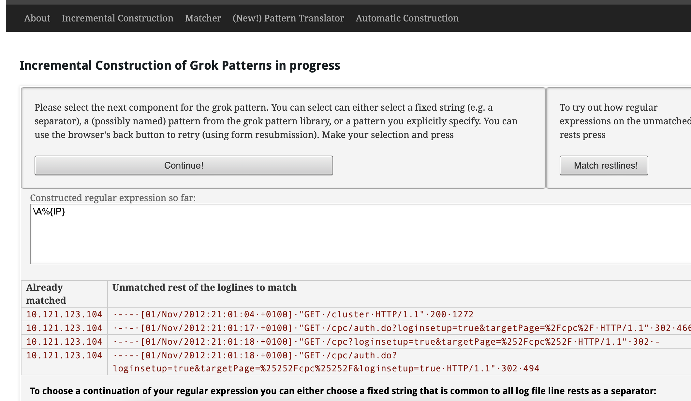

# 📈 Elastic Stack (ELK)

# Table of contents
<!-- toc -->

ELK is great for **Centralized Logging**, this enable us to not waste time
trying to find where the issues are, we have all in one place. We also can

Kibana is the visualization of the ELK stack, you can visualize the data on
real time.

# Components

It has several open source add-ons, but the main ones are these:

- **Beats**:
    - Light weight way of getting data into the ELK stack.
    - Single purpose tools.
- **Logstash**:
    - Transform data as it comes into structured data that will be stored.
    - Very resource intensive
    - Example: is like cutting carrots 🥕 as you get from the store and saving
      them to the fridge, instead of cutting them until you are about to cook
- **Elasticsearch**:
    - The part of the stack that stores the data itself
    - Usually deployed by a cluster, it has redundant copies so it can work if
      something fails
- **Kibana**:
    - Web front end for the ELK stack
    - Quick bird’s eye view across your infra

# Logstash

Three block  of code in config

- Input: get data in
- Output put data somewhere, usually elasticsearch
- Filter block: where data is transformed and relocated, where we can parse
  lines.

Example of config file.

```bash
input { stdin {} }

filter {
	mutate {
		add_field => { "greeting" => "Hello %{message}" }
	}
}

output { stdout {} }
```

This will take input from `STDIN` and output it to `STDOUT`, anything we type would be returned in a structured format with a `greeting` field.

## Logstash Plugins

It has more than 100 packages installed with logstash

`/usr/share/logstash/bin/logstash-plugins list` for listing them

- Beats: Input plugin to work with `beats`

    ```bash
    input { beats { port => 5044 } }
    ```

- File:
    - Get input from a file, or multiple, you can use wildcards

    ```bash
    input { file { path=> "/var/log/kern.log" } }
    ```

- elasticsearch
    - this is an **output** plugin, you can point to multiple servers

    ```bash
    output { elasticsearch { host => ["localhost:9200"] } }
    ```


## Filters

- Grok
    - convert unstructured data to structured data
    - based on regex, but it has many abstractions in case you want to use them

    ```bash
    filter {
    	grok {
    		match => {
    			"message" => "%{IP:client} %{WORD:method} %{URIPATHPARAM}:request...."
    		}
    	}
    }
    ```

- Mutate
    - let you transform the data

    ```bash
    filter {
    	grok {
    		match => {
    			"message" => "%{TIMESTAMP:t} new users: %{GREEDYDATA:users}"
    			# 2024-01-23 new users: jose,pedro,maria
    		}
    	}

    	mutate {
    		split => {"users" => ","}
    	}
    }
    ```

    In this example *grok* will get the time stamp of the message and will get all the string after `new users:` then we use *mutate* to split the users and have it stored as a list so when the data shows up in elasticsearch it looks like an array


## GrokConstructor

[grokconstructor.appspot.com](http://grokconstructor.appspot.com) Helper for creating grok filters.

You can see also some **grok patterns** too.

Basically you can paste the logs there build your filter from there



# Beats

Why use beats? Logstash is overkill for a lot of things people use it for.

It uses JRuby (basically ruby that runs on the JVM), and by default it is
configured to set aside 1GiB of memory for the JVM. That is too much to just
send things to Elastic

**Beats** (written in Go) is way more 🪽**lightweight**, it has been design to be. Becuase of this can be run everywhere.

There are several beats

- Heartbeat (Uptime)
- Filebeat (Logs and text data)
- Metricbeat (Metrics)
- Packetbeat (Network data)
- Winlogbeat (Windows events logs)
- Auditbeat (audit logs and data)
- Functionbeat (serverless data)

<aside>
💡 Note on Heartbeat (on opposed to other beats) run centrally and monitors
servers, instead of the other way around.
</aside>
